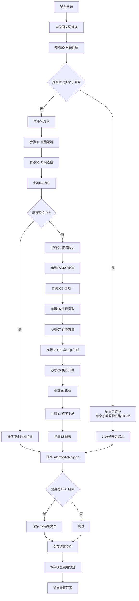
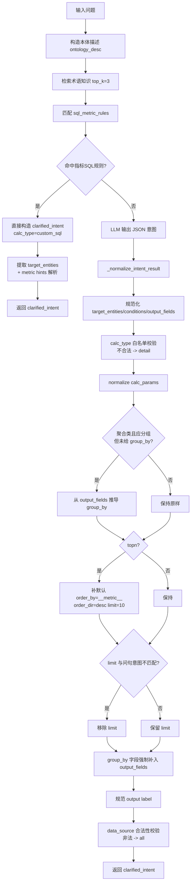
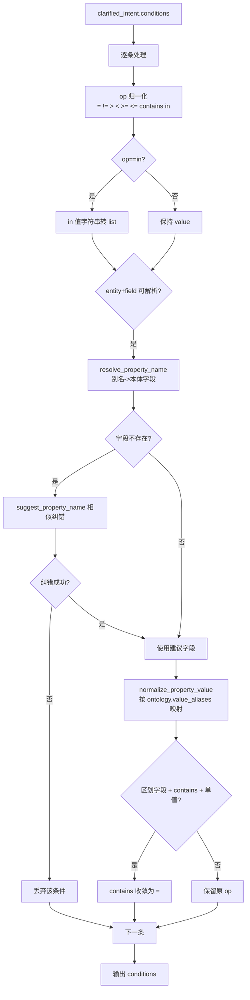
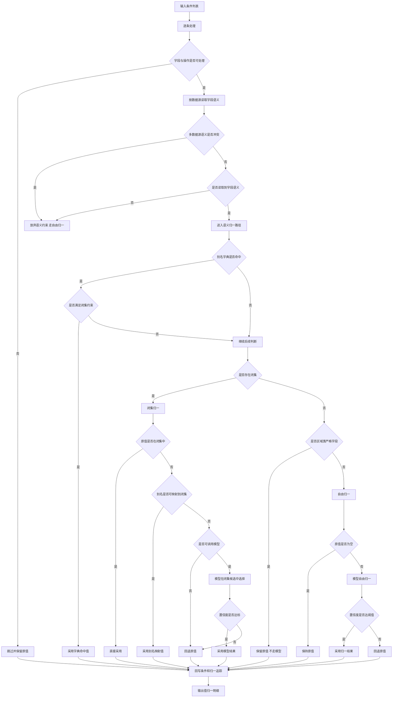
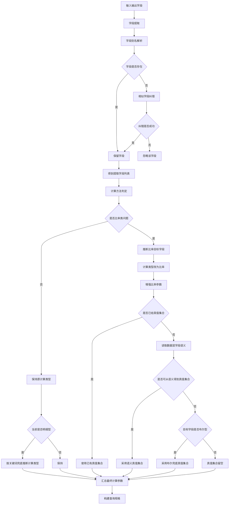
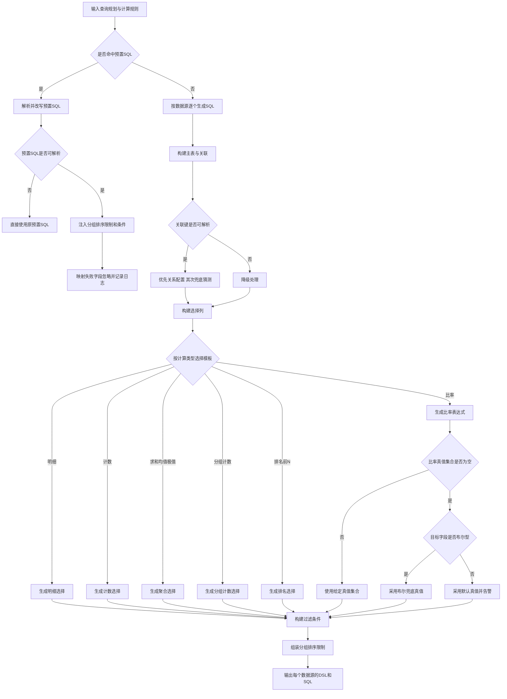
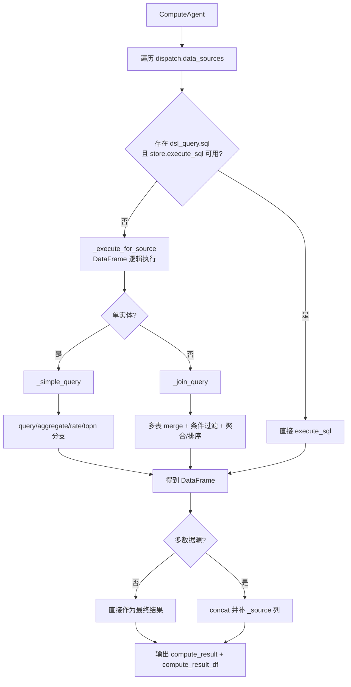
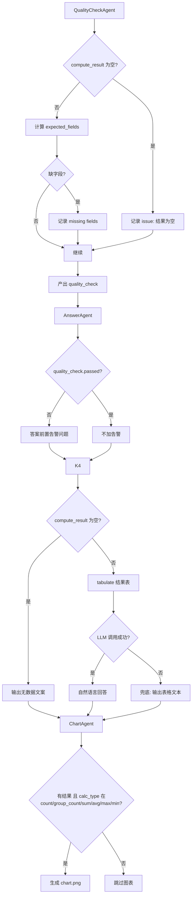

# 智能问数系统完整流程图（含筛选/过滤/兜底）

本文基于当前代码实现整理，覆盖从自然语言到 SQL/执行结果/回答的完整链路。

## 1. 总体编排流程（主调度）

## 2. 步骤01 意图澄清详细分支

## 3. 步骤05 条件筛选（字段/操作符/区划过滤）

## 4. 步骤05B 值归一（数据层语义 + 模型兜底）

## 5. 步骤06-07 字段提取与计算规则

## 6. 步骤08 DSL与SQL生成

## 7. 步骤09 执行与结果合并

## 8. 步骤10-12 质检、回答与图表

## 9. 当前实现中的“关键过滤点”清单

- 问题级过滤：`rewrite_rules` 仅替换命中词，不命中不改写。
- 意图级过滤：`calc_type` 白名单、`op` 白名单、`data_source` 合法性校验。
- 条件级过滤：字段不存在时尝试相似纠错；纠错失败直接丢弃该条件。
- 区划条件过滤：区划字段的 `contains` 在单值场景收敛成 `=`。
- 值语义过滤：多数据源语义不一致时，直接放弃语义约束，退回模型自由归一。
- strict_dict 过滤：区域类字段 alias 未命中时不走 LLM，防止错映射。
- 闭集过滤：LLM 选闭集值必须满足 `confidence_threshold`，否则回退原值。
- 比率真值过滤：优先 `rate_true_values`，其次闭集推断，再到布尔兜底。
- SQL 条件过滤：`in []` 强制 `1=0`，`None` 转 `IS NULL/IS NOT NULL`。
- 质检过滤：结果为空、字段缺失会生成 issues，传递给回答阶段。

## 10. 当前实现中的“关键兜底点”清单

- 意图澄清 LLM 不可用时，返回最小化结构并走后续流程。
- 知识验证未通过不会拦截，只告警继续执行。
- 调度目前默认 `action=execute`，仅保留中止钩子。
- rate 未识别目标字段时，尽量退化到候选首字段。
- rate 未配置真值时：布尔字段用布尔兜底；非布尔字段默认 `['是']`。
- SQL JOIN 无法解析时，退化到弱关联/并列表达，不抛异常中断。
- 执行阶段每个数据源异常互相隔离，失败源返回空 DataFrame。
- 回答阶段 LLM 异常时退化为“表格文本回答”。
- 图表阶段异常仅记录日志，不影响主答案输出。

---

如需“按文件/函数级别”的流程图（标注到函数名和行号）可以在本文件继续追加 V2。 
