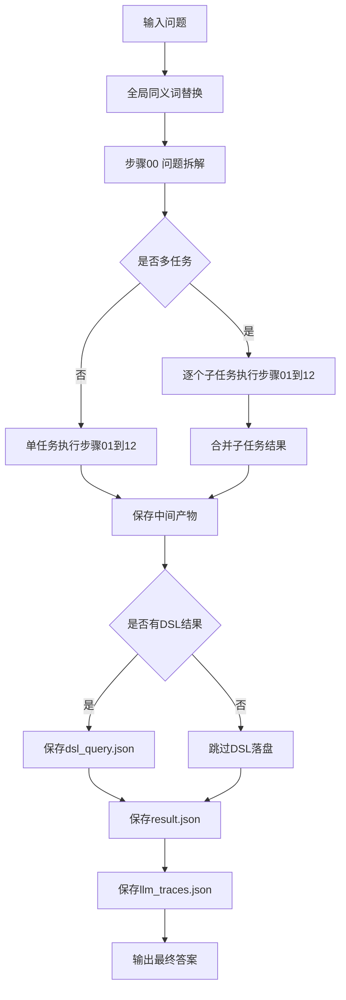
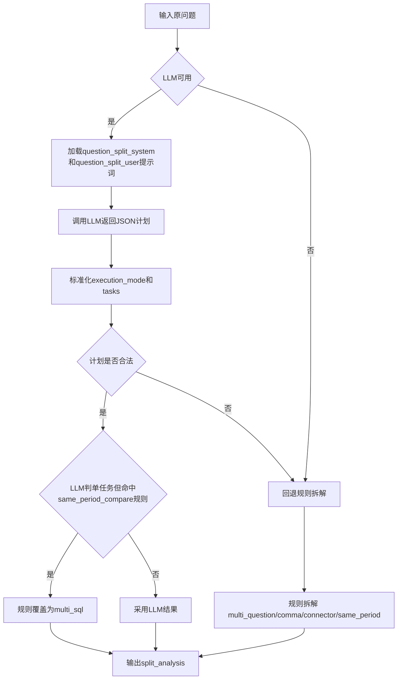
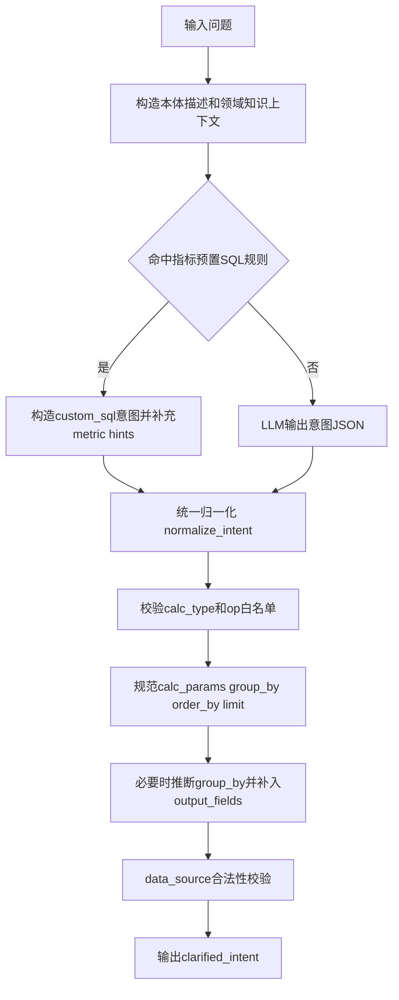
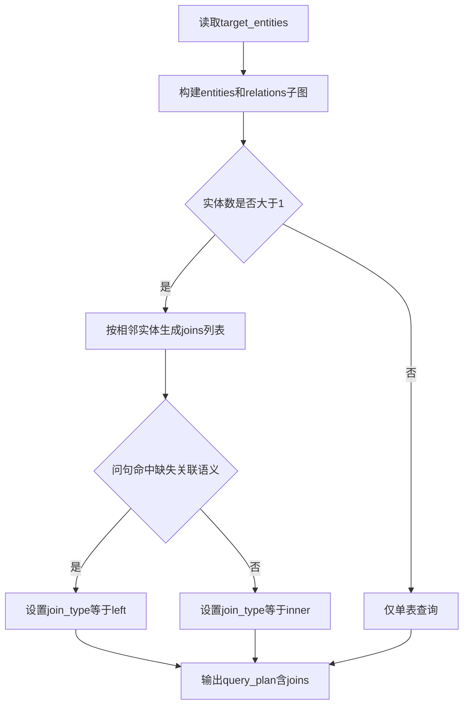
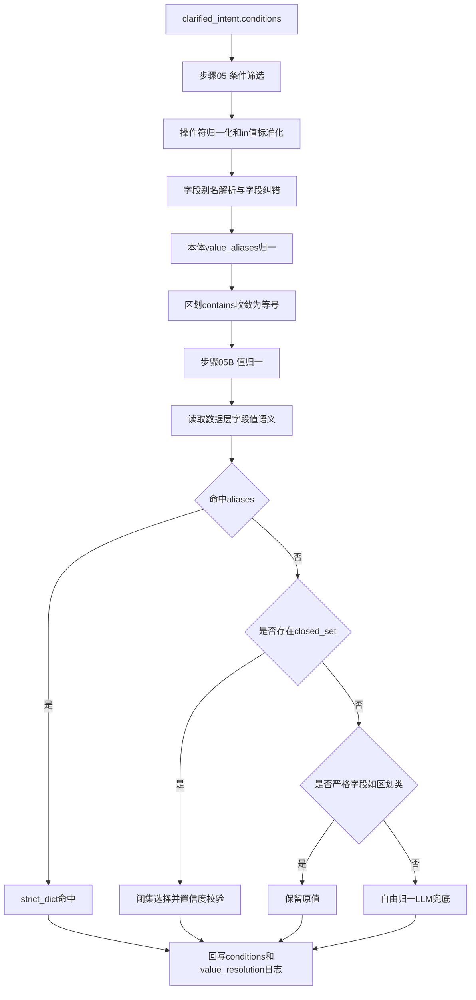
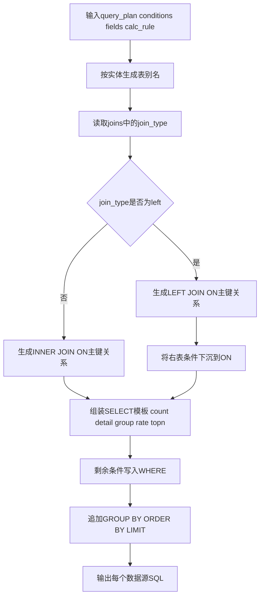
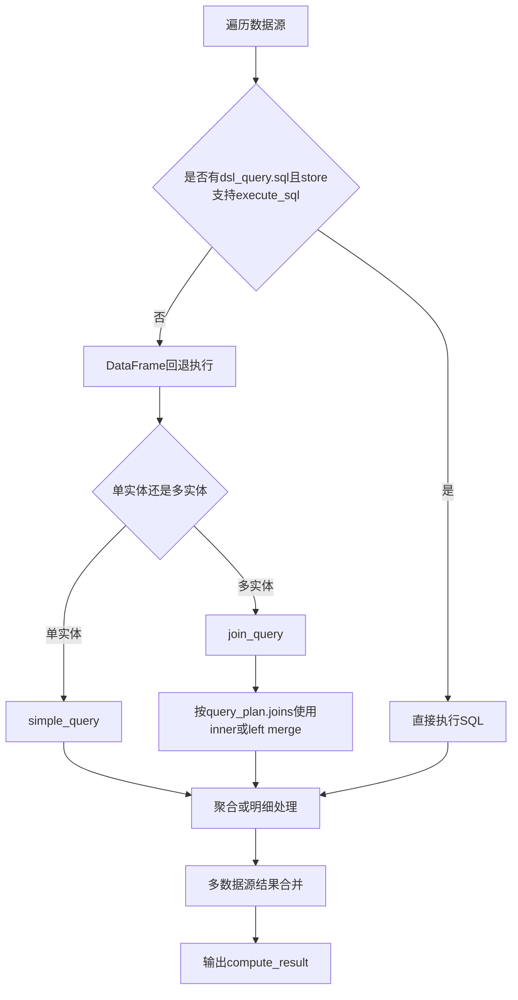
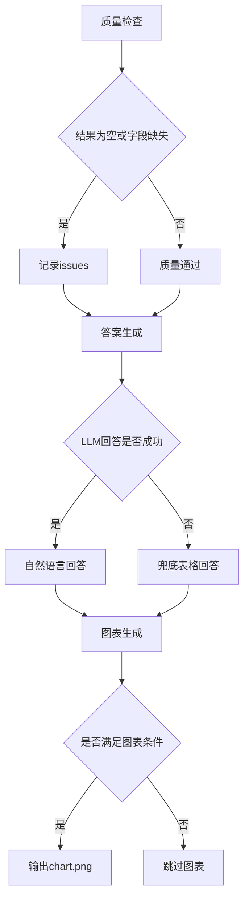

# 智能问数系统完整流程图（最新）

本文按当前代码实现整理，重点更新了三处：
- Step00：问题拆解已改为 `LLM任务规划 + 规则校验兜底`。
- JOIN：已支持 `INNER JOIN` 与 `LEFT JOIN`。
- LEFT JOIN 细节：右表条件会下沉到 `ON`，避免被 `WHERE` 退化成 INNER。

## 1. 主流程总览

## 2. 步骤00 问题拆解（任务规划）

## 3. 步骤01 意图澄清（结构化意图）

## 4. 步骤04 查询规划（实体图与JOIN策略）

说明：缺失关联语义关键词包括“未关联、没有关联、无关联、未匹配、不存在、为空、缺失、未配置”等。

## 5. 步骤05 与 05B（条件筛选和值归一）

## 6. 步骤08 SQL生成（INNER和LEFT）

关键点：
- `LEFT JOIN` 下，右表条件下沉到 `ON`。
- 未下沉的条件才放 `WHERE`。
- 这样可以避免 `LEFT JOIN` 被错误退化为 `INNER JOIN`。

## 7. 步骤09 执行计算（SQL优先）

## 8. 步骤10到12（质检 回答 图表）

## 9. 关键过滤点与兜底点（更新后）

### 关键过滤点
- Step00：LLM规划结果会做结构合法性校验，不合法回退规则拆解。
- Step05：字段不存在先纠错，纠错失败直接丢弃该条件。
- Step05B：闭集选择需满足置信阈值，否则回退原值。
- Step08：`LEFT JOIN` 右表条件优先下沉 `ON`，防止语义误伤。

### 关键兜底点
- Step00：LLM不可用或异常时，回退规则拆解。
- Step01：LLM异常时返回最小结构继续流程。
- Step08：关联键无法解析时退化为弱关联路径并记录日志。
- Step09：单数据源失败不拖垮整体，返回空结果并继续后续步骤。

---

如果你需要，我可以再补一版“按文件/函数级别”的流程图（每个节点标注到具体函数名）。
